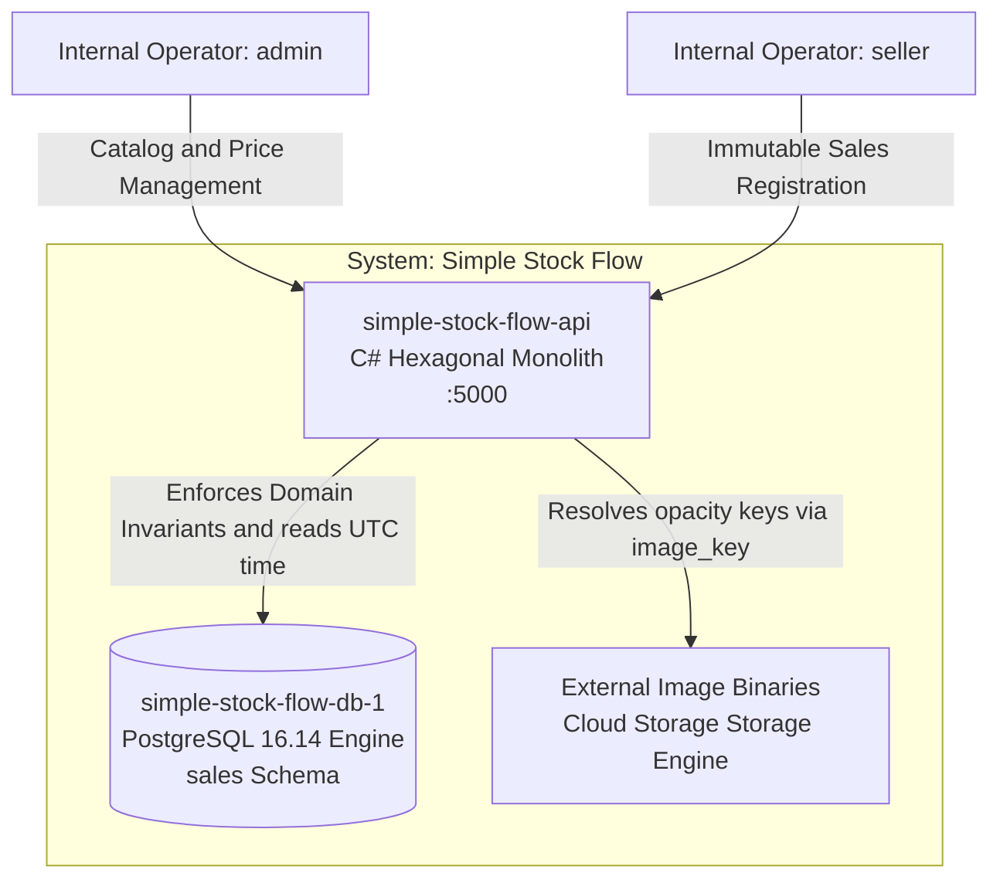

# System Architecture Overview

> **What to fill in here:** The architectural view is the technical snapshot of the system.
> It includes the C4 system and container diagram, service list, and architectural principles.
> This document is created after the main ADRs and guides the implementation.

---

## 1. Adopted architectural style

**Style:** Monolito Hexagonal (Ports & Adapters) con Capa de Persistencia Relacional Cualificada.

**Justification:** El sistema está diseñado de forma monomoneda (D-05) y centraliza un volumen acotado de datos (5 categorías fijas sembradas y 3 entidades transaccionales básicas). El estilo de monolito hexagonal implementado en C# aísla las invariantes del core en el centro de la aplicación, delegando el cumplimiento de las restricciones últimas e históricos estables al motor PostgreSQL 16.14 de forma síncrona y atómica, lo que elimina la sobrecarga operativa de microservicios o brokers distribuidos.

**Reference ADR:** `adr/adr-001-propiedad-del-esquema.md` y `adr/adr-002-concurrencia-optimista.md`

---

## 2. C4 Diagram — System Level (Context)

> Shows how the system fits in the world. External actors and external systems.

┌─────────────────────────────────────────────────────────────────────┐
│                 System: Simple Stock Flow Monolith                  │
│                                                                     │
│  ┌────────────────────────┐         ┌────────────────────────────┐  │
│  │ simple-stock-flow-api  │         │ External Storage Adapter   │  │
│  │ (C# Hexagon Core)      │         │ (Opac Image Asset Keys)    │  │
│  │ Port: 5000 / 5001      │         │ Mapped via image_key field │  │
│  └──────────┬─────────────┘         └──────────────┬─────────────┘  │
│             │                                      │                │
│             └───────────────────┬──────────────────┘                │
│                                 │ Synchronous Memory Invocations    │
└─────────────────────────────────│───────────────────────────────────┘
│
┌──────────▼──────────┐
│   Internal Operators│
│   (admin / seller)  │
└─────────────────────┘

---

## 3. C4 Diagram — Container Level

> Shows the processes, databases, and main communication channels.

---

## 4. Service catalog

| # | Service | Responsibility | Port | DB | Communication type |
|---|---------|---------------|------|-----|-------------------|
| 1 | simple-stock-flow-api | Orquestación de casos de uso del catálogo, control de stock no negativo y cálculo dinámico en motor del reporte agregado (Q9) sin persistencia. | 5000 | PostgreSQL 16.14 (Base `simple_stock_flow`) | In-memory sychronous Layer Mappings (Hexagon) |

---

## 5. Architectural principles

These principles guide the project's technical decisions. Before making an important decision,
verify it is consistent with these principles.

### P1: Domain Isolation (Hexagonal Rule)
The business domain layer must remain pure C# and strictly isolated from framework, ORM, or data migration definitions. No infrastructure layer components can leak into the domain core.

### P2: Engine-Backed Safety
The database engine is the last line of defense. All critical application invariants checked by the domain (such as `stock >= 0` or role validations) must be explicitly backed by physical engine constraints or unique indices inside PostgreSQL.

### P3: Accounting Immutability
A sale transaction is an alterable commercial fact. The system contains no physical deletion or update endpoints for the `sale` or `sale_item` tables, guaranteeing contable tracking permanence.

### P4: On-Demand Query Agregations (D-06)
Business reporting is non-persisted by design. Analytical summaries (like the Q9 aggregation) are calculated dynamically inside the database engine using composite indexes, preventing old closed data from mutating retroactively.

### P5: Monomode Platform (D-05)
The platform is single-currency by construction. No secondary currency column mappings, exchange logic routines, or foreign calculations are permitted within the core schema.

---

## 6. Adopted architectural patterns

| Pattern | Adopted | Reference |
|---------|---------|-----------|
| Ports and Adapters | Yes | `hexagonal-architecture.md` |
| Optimistic Concurrency | Yes | Enforced via PostgreSQL native `xmin` system column token (D-04) |
| Soft Delete (Baja Lógica) | Yes | Mapped on `product` table via shadow property `deleted_at` + global filters (ADR-003) |
| Dynamic Aggregation | Yes | Calculated in-engine via optimized composite indices to skip reporting tables (D-06) |
| Composite Unique Indexes | Yes | Implemented across `(sale_id, product_id)` to secure transaction uniqueness |

---

## 7. Cross-cutting concerns

Transversal concerns that apply to the monolith service:

| Concern | Adopted solution | Where it is configured |
|---------|----------------|------------------------|
| Authentication / Authorization | JWT validation checking a closed pair of static operator roles (`admin` / `seller`). | `UserContext` / `Program.cs` API pipeline mapping |
| Concurrency Control | Native PostgreSQL `xmin` increment tracking on `UPDATE` execution blocks. | Mapped via Entity Framework Core shadow property (T-10) |
| Soft Delete Filtering | Global shadow filters evaluating `deleted_at IS NULL` for active product catalog lookup. | `src/adapters/outbound/persistence/Configurations/` |
| Error handling | Fluent domain exceptions throwing structural code errors directly to the presentation wrapper. | Domain Exception Middleware handlers |
| Seeding Strategy | Hardcoded literal version 4 UUID entries injected strictly at the initial schema migration. | `InitialSchema` migration definition (§9.1) |

---

## 8. Registered architectural technical debt

| ID | Description | Impact | Priority | Target sprint |
|----|-------------|--------|---------|--------------|
| AT-11 | Falta de congelación de etiquetas de categoría (`sale_item.category_name`) en la línea de venta. | Medium | P1 | Sprint 4 (Actual) |
| AT-12 | Atribución de venta `sold_by` manejada como cadena simple de texto sin clave foránea restrictiva hacia `user.id`. | High | P1 | Sprint 5 |
| AT-20 | Alineación de las 5 invariantes marcadas como *solo dominio* hacia restricciones `CHECK` reales en el motor. | High | P1 | Sprint 5 |

---

## 9. Planned evolution

| Version | Architectural change | Motivation | Estimated date |
|---------|---------------------|------------|----------------|
| v0.5.0 | Integration of `pg_trgm` extension trigram indices inside the applied EF migrations. | Optimize Q1 partial text catalog wildcards lookup efficiently without superuser requirements. | November 2026 |

---

## Key correlations

- Domain bounded contexts → `domain-map.md`
- Hexagonal architecture per service → `hexagonal-architecture.md`
- Core database physical constraints overview → `data_model.md`
- Technical debt tracking backlog issues → `tasks.md`
